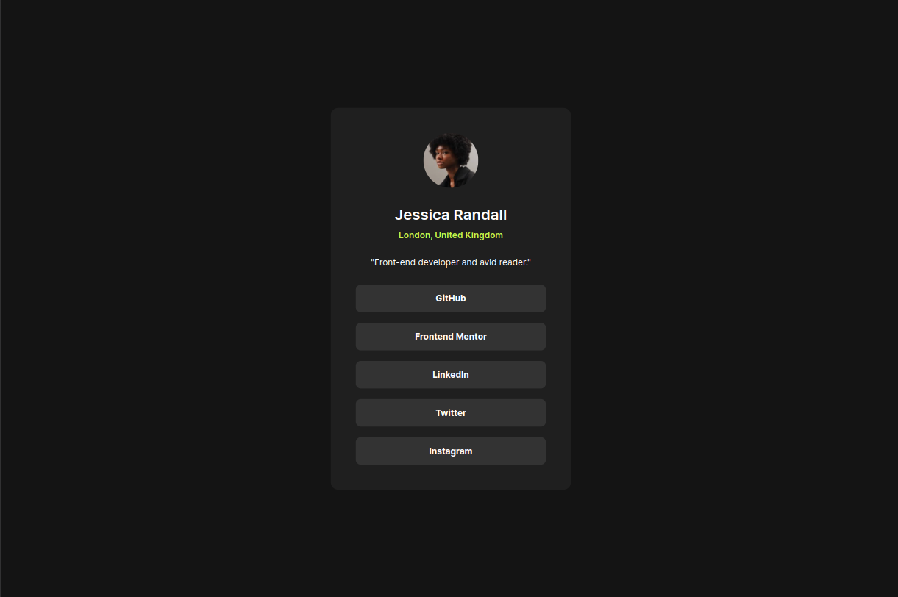

# Frontend Mentor - Recipe page solution

This is a solution to the [Social links profile challenge on Frontend Mentor](https://www.frontendmentor.io/challenges/social-links-profile-UG32l9m6dQ).
Frontend Mentor challenges help you improve your coding skills by building realistic projects.

## Table of contents

- [Overview](#overview)
  - [Screenshot](#screenshot)
  - [Links](#links)
  - [Links](#links)
- [Built with](#built_with)
- [Acknowledgments](#acknowledgments)

## Overview

### Screenshot

### Links

-Solution URL: [https://www.frontendmentor.io/solutions/my---social-links-profile-solution-6zaGciJvEy](https://www.frontendmentor.io/solutions/my---social-links-profile-solution-6zaGciJvEy)

-Live Site URL: [https://gabrieljesuss.github.io/frontendmentor_social-links-profile-main/](https://gabrieljesuss.github.io/frontendmentor_social-links-profile-main/)

### Built with

- Semantic HTML5 markup
- Tailwind CSS
- Mobile-first
- [Parcel](https://parceljs.org/) - JS Bundler

## Author

- Frontend Mentor - [@GabrielJesusS](https://www.frontendmentor.io/profile/GabrielJesusS)
